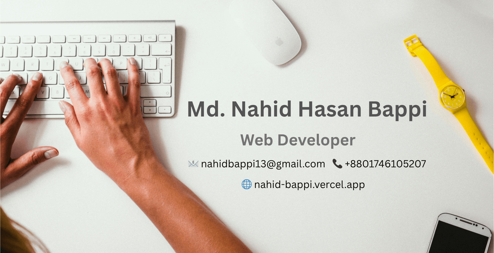

<!-- HEADER WITH PROFILE IMAGE -->

  <h1>Hi, I'm Md. Nahid Hasan Bappi 👋</h1>
  
<i>Aspiring Junior Web Developer | Lifelong Learner | Problem Solver</i>

  <a href="https://mail.google.com/mail/?view=cm&fs=1&to=nahidbappi13@gmail.com" target="_blank">📩 Contact Me</a>

---

### 👨‍💻 Who Am I?

🎓 A sociology graduate from **Dhaka University** who fell in love with code  
🛠️ Transitioned into **web development** with a passion for building things from scratch  
💡 Driven by curiosity, logic, and clean UI/UX  
🌱 Currently diving deep into **DSA, Next.js & TypeScript**

---

### ⚒️ My Stack at a Glance

  

🧠 Comfortable with: JavaScript, React, Node.js, MongoDB, Express.js  

🧰 Tools I use: GitHub, Postman, VS Code, Vercel, Netlify, npm/yarn Excel, Word, PowerPoint, Canva

📈 Learning now: Next.js, DSA (JavaScript), TypeScript, Redux

🧩 Bonus: Strong leadership, communication & analytical thinking

---

### 🚀 Featured Projects

| Name | Live Demo | Stack |
|------|-----------|-------|
| Culinary Canvas | [Live](https://culinary-canvas-kitchen.netlify.app/) | JWT, React.js, Node.js, Express.js, MongoDB, Firebase, dotenv, cors, cookie-parser,Vite, Axios, TanStack Query, Context API |
| Sports Gear | [Live](https://sports-gear.netlify.app/) | Node.js, Express.js, MongoDB, dotenv, cors, React.js, Vite, Axios, Tailwind CSS, TanStack Query, Lottie React, React Slick, React Icons, Styled-Components, React Helmet, Context API |
| Career Inspire | [Live](https://career-inspire.netlify.app/) |React.js, vite, Firebase, DaisyUi, HTML, react helmet, AOS, Swiper, React Modal, material-tailwind, React Toastify |
| Gadget Heaven | [Live](https://gadget-heaven-tech-hub.netlify.app/) | React.js, firebase, Tailwind, DaisyUi, React Helmet Async, React Icons, React Toastify, Lodash.debounce |
| NHB Dream 11 | [Live](https://nhb-dream-11.netlify.app/) | React.js, React Toastify |
| PetVibe | [Live](https://petvibe.netlify.app/) | Js, html, css |

🧪 View More: [My Netlify Portfolio](https://app.netlify.com/teams/nbappi13/sites)

---

### 🔍 Problem Solving Journey

- Practicing C programming on [Codeforces](https://codeforces.com/profile/nahidbappi13)  
- Regularly sharpening logic, time management, and thinking in code  
- Current Goal: 1500+ rating & solving DSA in JS

---

### 📊 GitHub Overview

  
  

  

---

### 🏆 Achievements & Trophies

  

---

### 🔗 Let's Connect & Collaborate

  
  
  
  
  

---

### 💬 Something Personal

> *“I believe in growing trees 🌳 and growing knowledge 📚. Whether in code or nature, growth is my purpose.”*  
> — Nahid Hasan Bappi

---

  🔍 Actively seeking a **Junior Web Developer** role  
  🤝 Open to internships, open-source, and freelance projects  

